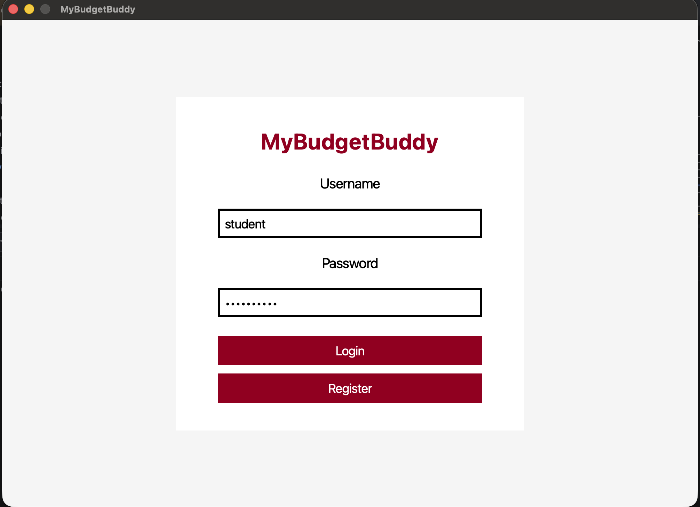
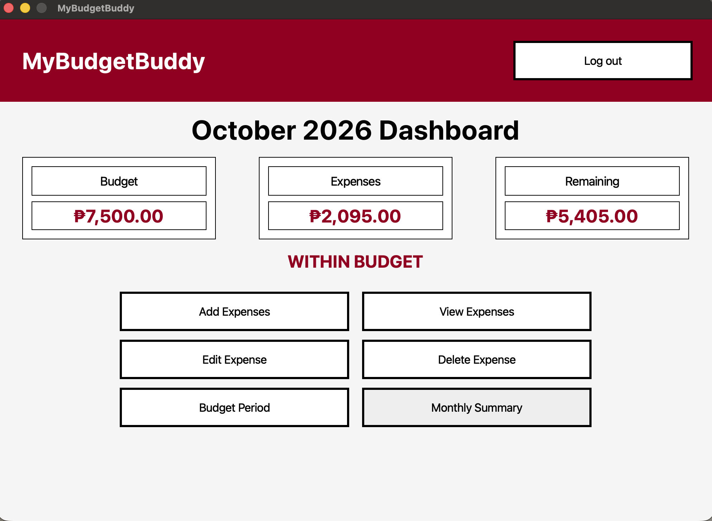
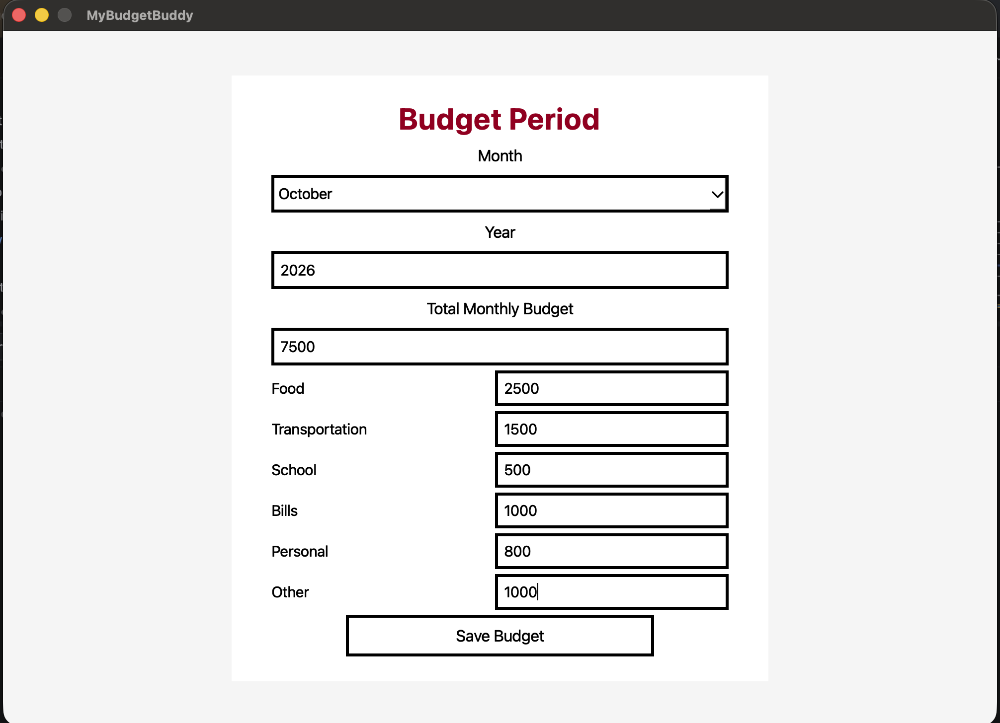
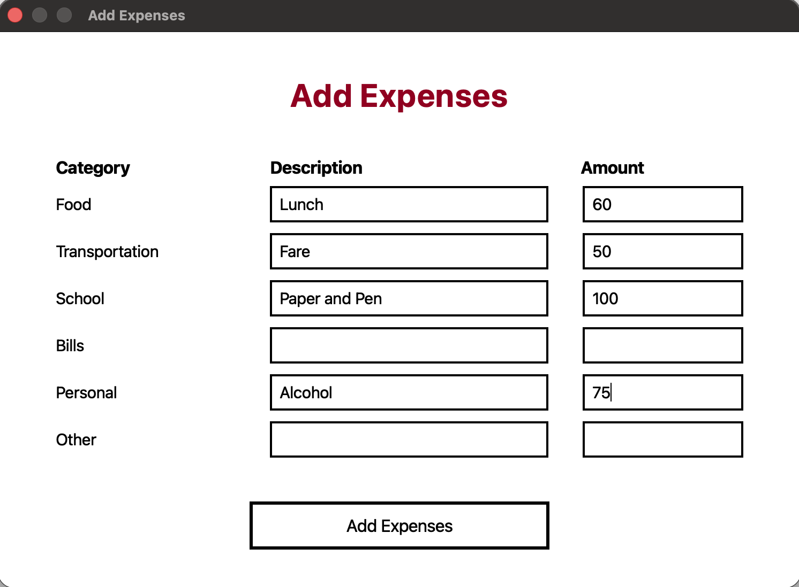
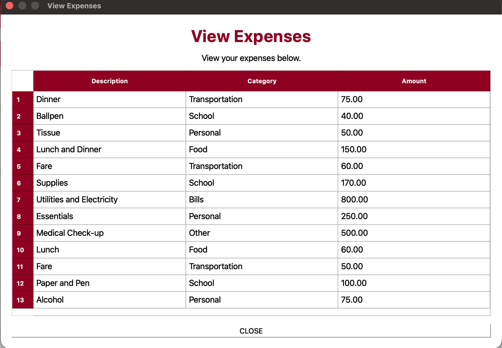
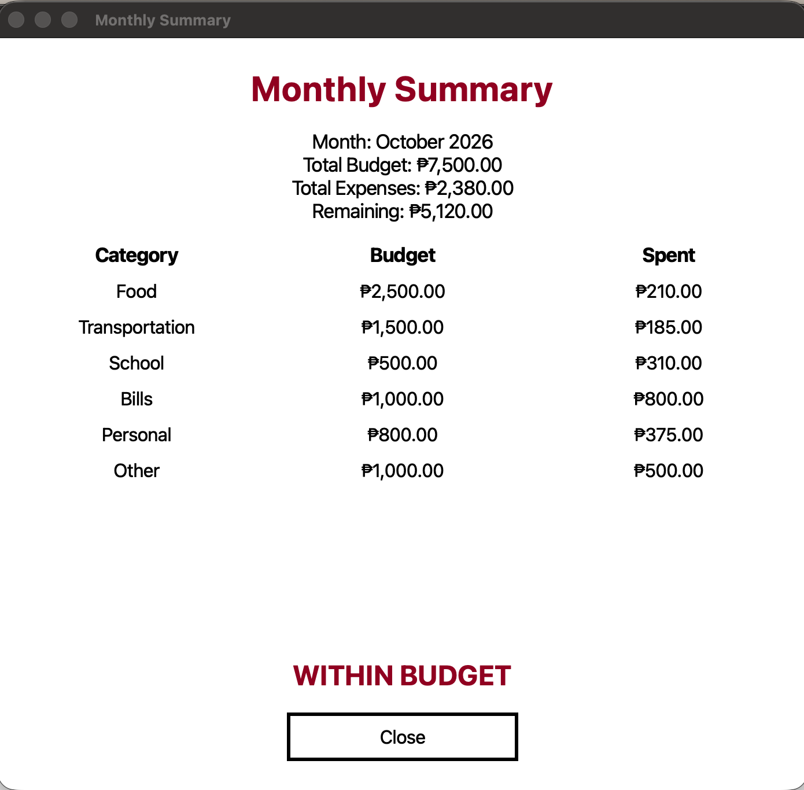

# MyBudgetBuddy

## Project Description

MyBudgetBuddy is a personal budgeting and expense tracking system developed using Python. It allows users to set a monthly budget, assign budgets to different categories, record expenses, update expenses, delete expenses, and view a monthly summary.

The system addresses the problem of manually tracking expenses and budgets. It helps users organize their spending and see how much of their budget has been used and how much remains.

## Project Objectives

The main objectives of MyBudgetBuddy are:

- To create a simple budgeting and expense tracking system.
- To allow users to manage their monthly budget.
- To allow users to record, view, update, and delete expenses.
- To organize expenses into different categories.
- To provide a monthly summary of the user's budget and expenses.
- To store user and financial data using a database.
- To apply object-oriented programming and modular programming concepts.

## Features

### User Login

Users can log in using their username and password.

### User Registration

New users can create an account using the Register feature.

### Budget Period

Users can set their monthly budget and assign amounts to the following categories:

- Food
- Transportation
- School
- Bills
- Personal
- Other

The month dropdown starts at January and allows users to scroll and select their desired month.

### Add Expenses

Users can add expenses by entering the description and amount for each category.

### View Expenses

Users can view their recorded expenses in a table containing:

- Description
- Category
- Amount

### Edit Expense

Users can update existing expenses. They can change the description, category, and amount of multiple expenses before saving.

### Delete Expense

Users can select an expense and delete it from the expense list.

### Monthly Summary

Users can view a summary containing:

- Total Budget
- Total Expenses
- Remaining Budget
- Budget for each category
- Expenses for each category
- Budget status

### Budget Status

The system checks the user's spending and displays the current budget status:

- WITHIN BUDGET
- WARNING: 80% OF BUDGET USED
- BUDGET FULLY USED
- OVER BUDGET

## Technologies Used

### Programming Language

- Python

### GUI Framework

- PyQt6

### Database

- SQLite

### Libraries and Tools

- `sqlite3` - used for SQLite database operations.
- PyQt6 - used to create the graphical user interface.
- PyCharm - used for developing and testing the project.
- GitHub - used for version control and project storage.

## Project Structure

```text
MyBudgetBuddy/
│
├── main.py
├── mybudgetbuddy.db
│
├── database/
│   ├── __init__.py
│   └── database.py
│
├── features/
│   ├── __init__.py
│   │
│   ├── authentication/
│   │   ├── __init__.py
│   │   ├── model.py
│   │   ├── repository.py
│   │   ├── service.py
│   │   └── view.py
│   │
│   ├── budget/
│   │   ├── __init__.py
│   │   ├── model.py
│   │   ├── service.py
│   │   └── view.py
│   │
│   ├── expenses/
│   │   ├── __init__.py
│   │   ├── model.py
│   │   ├── repository.py
│   │   ├── service.py
│   │   └── view.py
│   │
│   └── dashboard/
│       ├── __init__.py
│       └── view.py
│
├── screenshots/
│   ├── add-expenses.png
│   ├── budget-period.png
│   ├── dashboard.png
│   ├── login.png
│   ├── monthly-summary.png
│   └── view-expenses.png
│
└── README.md

```
### File and Folder Description

**`main.py`**

The main entry point of the application. It starts the PyQt6 application and loads the saved data.

**`database/`**

Contains the files responsible for connecting to and managing the SQLite database.

**`database/database.py`**

Creates the database tables and performs the main database saving and loading operations.

**`features/`**

Contains the different features of the system.

**`features/authentication/`**

Contains the login and registration functionality.

- `model.py` - creates user data.
- `repository.py` - handles user data storage and registration.
- `service.py` - handles login and account creation logic.
- `view.py` - displays the login and registration interface.

**`features/budget/`**

Contains the budget functionality.

- `model.py` - creates budget data.
- `service.py` - calculates remaining budget and budget status.
- `view.py` - displays the Budget Period interface.

**`features/expenses/`**

Contains the expense functionality.

- `model.py` - creates expense data.
- `repository.py` - handles adding, updating, and deleting expenses.
- `service.py` - handles expense operations and calculations.
- `view.py` - displays the Add, View, Edit, and Delete Expense interfaces.

**`features/dashboard/`**

Contains the main dashboard interface.

- `view.py` - displays the dashboard and connects the different features of the system.

**`screenshots/`**

Contains screenshots of the working application.

## Installation and Setup

### 1. Install Python

Make sure Python is installed on the computer.

### 2. Download or Clone the Project

Download the MyBudgetBuddy project or clone the project from GitHub.

### 3. Open the Project

Open the project folder using PyCharm.

### 4. Install the Required Dependency

Open the terminal in the project folder and run:

```bash
pip install PyQt6

```
The project only requires PyQt6 because SQLite is already included with Python through the `sqlite3` module.

### 5. Run the Application

Run the following file:

```text
main.py
```

The MyBudgetBuddy login screen will appear.

## How to Use the System

### 1. Login

Start the application and log in using an existing account.

A default account is available:

```text
Username: admin
Password: admin123
```

Users can also click **Register** to create a new account.

### 2. Set the Budget

After logging in, open **Budget Period**.

Select a month from the dropdown. January is selected by default, and the user can scroll through the months.

Enter:

- Year
- Total Monthly Budget
- Food Budget
- Transportation Budget
- School Budget
- Bills Budget
- Personal Budget
- Other Budget

Click **Save Budget**.

### 3. Add Expenses

Click **Add Expenses**.

Enter the description and amount for the appropriate expense categories.

Click **Add Expenses** to save the expenses.

### 4. View Expenses

Click **View Expenses** to see the recorded expenses.

### 5. Edit Expenses

Click **Edit Expense**.

The existing expenses will be displayed with editable fields.

Users can change multiple expenses and then click **SAVE**.

### 6. Delete Expenses

Click **Delete Expense**.

Select an expense and click **DELETE**.

Click **SAVE** to save the changes.

### 7. View Monthly Summary

Click **Monthly Summary** to view the total budget, expenses, remaining budget, category budgets, category expenses, and budget status.

### 8. Logout

Click **Log out** to return to the login screen.

## OOP Implementation

MyBudgetBuddy uses object-oriented programming through PyQt6 classes and custom classes.

### Important Classes

**`App`**

The `App` class in `features/dashboard/view.py` inherits from `QMainWindow`.

It controls the main application window and connects the different features such as the dashboard, budget, expenses, summary, and logout.

**`ExpenseFormDialog`**

The `ExpenseFormDialog` class in `features/expenses/view.py` inherits from `QDialog`.

It is used for adding expenses.

**`ExpenseListDialog`**

The `ExpenseListDialog` class in `features/expenses/view.py` inherits from `QDialog`.

It is used for viewing, editing, and deleting expenses.

### Encapsulation

Encapsulation is applied by organizing related data and functions inside classes and modules.

For example, `ExpenseListDialog` contains the interface and functions needed to manage expenses.

The project also separates the model, repository, service, and view responsibilities into different files.

### Inheritance

Inheritance is used in the PyQt6 interface.

For example:

```python
class App(QMainWindow):
```

The `App` class inherits from `QMainWindow`.

Other examples include:

```python
class ExpenseFormDialog(QDialog):
```

and:

```python
class ExpenseListDialog(QDialog):
```

These classes inherit the features of PyQt6's `QDialog`.

### Polymorphism

Polymorphism is applied through PyQt6 widgets and inherited methods.

For example, different PyQt6 classes such as `QMainWindow` and `QDialog` provide their own behavior while being used as windows in the application.

## Database

MyBudgetBuddy uses SQLite for data storage.

The database file is:

```text
mybudgetbuddy.db
```

The database is created and managed using Python's built-in `sqlite3` module.

### Database Tables

The system contains the following important tables.

### `users`

Stores user account information.

Important fields:

- `id`
- `username`
- `password`

### `budget`

Stores the monthly budget.

Important fields:

- `id`
- `month`
- `total`

### `category_budgets`

Stores the budget assigned to each expense category.

Important fields:

- `id`
- `category`
- `amount`

### `expenses`

Stores recorded expenses.

Important fields:

- `id`
- `description`
- `category`
- `amount`
### Database Operations

The system performs the following database operations.

**Create**

Creates database tables and inserts new users, budgets, category budgets, and expenses.

**Read**

Reads users, budgets, category budgets, and expenses from the database when the application starts.

**Update**

Updates saved information when the user changes the budget or edits expenses.

**Delete**

Removes expense records when the user deletes an expense and saves the changes.

**Search**

The login system searches the users table to check whether the entered username and password match an existing account.
## Screenshots

### Login Screen



Shows the login interface where users can enter their username and password.

### Dashboard



Shows the main dashboard with the monthly budget, total expenses, remaining budget, budget status, and available features.

### Budget Period



Shows the Budget Period interface where users can select a month and enter their monthly and category budgets.

### Add Expenses



Shows the interface for entering expense descriptions and amounts for different categories.

### View Expenses



Shows the table containing the user's recorded expenses.

### Monthly Summary



Shows the monthly budget summary, category budgets, category expenses, remaining budget, and budget status.
## Testing

The system was tested by performing different actions in the application and checking whether the expected results matched the actual results.

| Test | Expected Result | Actual Result |
|---|---|---|
| Login with correct account | User enters the system | Passed |
| Login with incorrect password | Login should be rejected | Passed |
| Register a new account | New account should be created | Passed |
| Set monthly budget | Budget should be saved | Passed |
| Add an expense | Expense should appear in View Expenses | Passed |
| View expenses | Saved expenses should be displayed | Passed |
| Edit an expense | Updated information should appear | Passed |
| Edit multiple expenses | Multiple changes should be saved | Passed |
| Delete an expense | Selected expense should be removed | Passed |
| View monthly summary | Correct budget and expense information should appear | Passed |
| Logout | User should return to login screen | Passed |

## Known Issues / Limitations

- The system is designed as a simple college-level budgeting application.
- User passwords are stored as plain text and are not encrypted.
- The application currently supports one budget period at a time.
- The system does not have online or cloud database synchronization.
- The application does not support multiple users using the application at the same time.
- The system does not include advanced financial reports or charts.
- The application is intended for basic personal budgeting and expense tracking.

## Author

**Name:** Mechelle Laguitao

**Section:** CS26(3581) BSCS-2